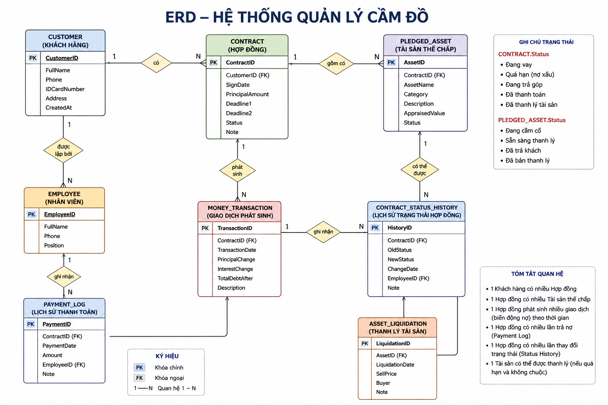
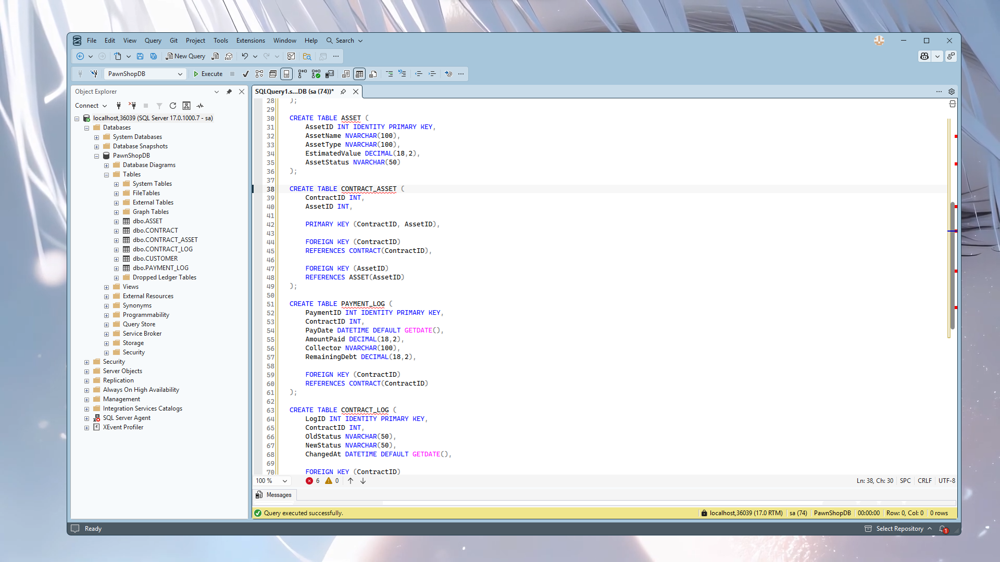
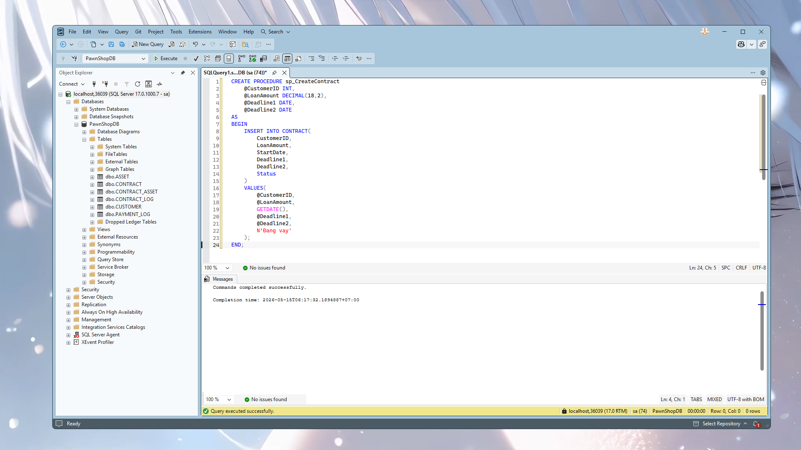
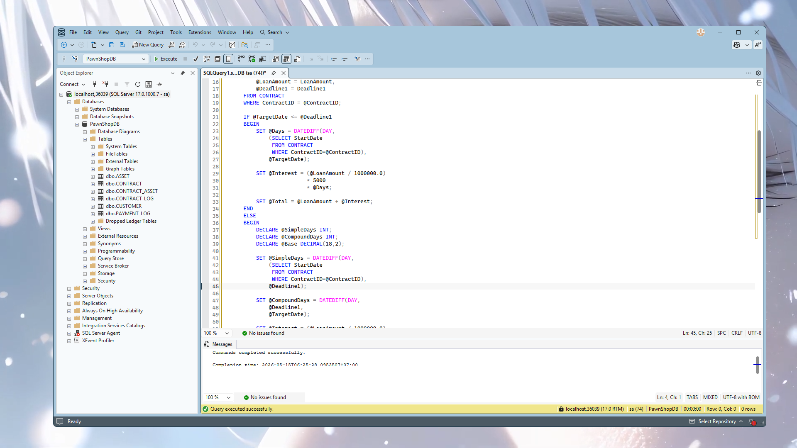
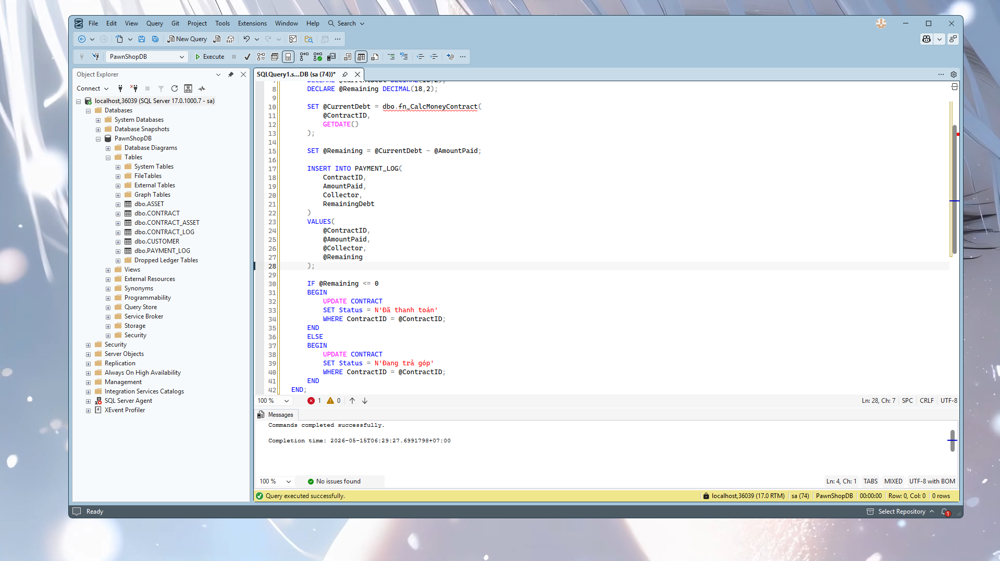
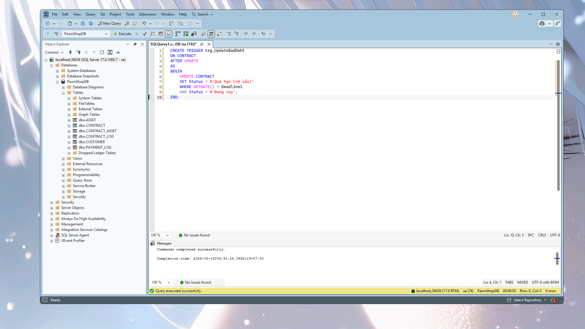
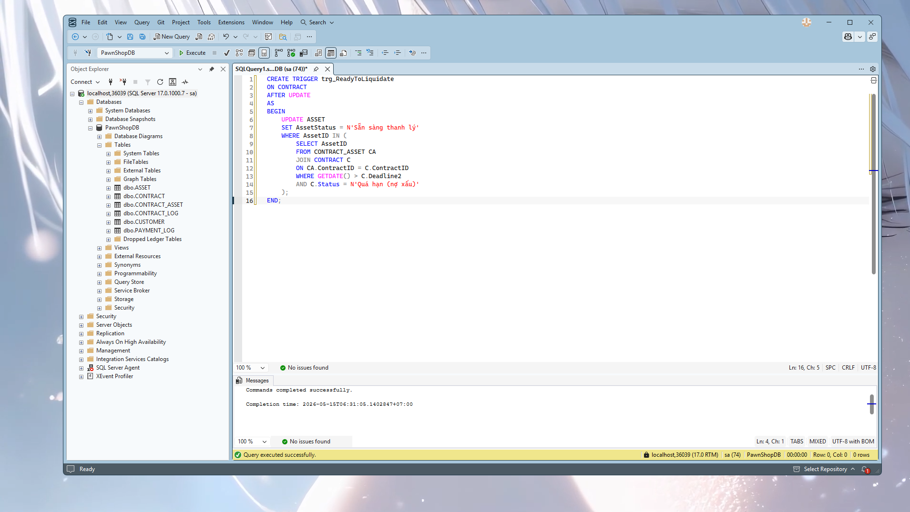

# 📘 BÀI TẬP 03 - SQL SERVER

## 🔰 Thông tin sinh viên

* Họ tên: *[TRẦN TÙNG LÂM]*
* Mã sinh viên: **K235480106039**
* Môn học: Cơ sở dữ liệu
* Chủ đề: **Quản lý cầm đồ**

---

## 🧾 Mô tả bài toán

Đề tài xây dựng hệ thống quản lý cầm đồ phục vụ cho:

* Quản lý khách hàng.
* Quản lý hợp đồng vay tiền.
* Quản lý tài sản thế chấp.
* Tính lãi đơn và lãi kép.
* Quản lý trạng thái hợp đồng.
* Quản lý lịch sử trả nợ.
* Quản lý thanh lý tài sản.

Hệ thống được xây dựng bằng SQL Server với các thành phần:

* Database.
* Table.
* Function.
* Stored Procedure.
* Trigger.
* Query báo cáo.

---

# 2. Công nghệ sử dụng

| Thành phần       | Công nghệ                    |
| ---------------- | ---------------------------- |
| Hệ quản trị CSDL | SQL Server                   |
| Ngôn ngữ         | T-SQL                        |
| Công cụ thiết kế | Draw.io / SQL Server Diagram |
| IDE              | SQL Server Management Studio |
| Version Control  | GitHub                       |

---

# 3. Thiết kế cơ sở dữ liệu

## 3.1 Các bảng chính

### CUSTOMER

Lưu thông tin khách hàng.

### CONTRACT

Lưu thông tin hợp đồng vay.

### ASSET

Lưu thông tin tài sản thế chấp.

### CONTRACT_ASSET

Liên kết hợp đồng và tài sản.

### PAYMENT_LOG

Lưu lịch sử trả nợ.

### CONTRACT_LOG

Lưu lịch sử thay đổi trạng thái.

---

# 4. Sơ đồ ERD

## Ảnh ERD


# 4.1 Script tạo bảng SQL

```sql
CREATE DATABASE PawnShopDB;
GO

USE PawnShopDB;
GO

CREATE TABLE CUSTOMER (
    CustomerID INT IDENTITY PRIMARY KEY,
    FullName NVARCHAR(100),
    Phone VARCHAR(20),
    Address NVARCHAR(255),
    CCCD VARCHAR(20),
    CreatedAt DATETIME DEFAULT GETDATE()
);

CREATE TABLE CONTRACT (
    ContractID INT IDENTITY PRIMARY KEY,
    CustomerID INT,
    LoanAmount DECIMAL(18,2),
    StartDate DATE,
    Deadline1 DATE,
    Deadline2 DATE,
    Status NVARCHAR(50),
    CreatedAt DATETIME DEFAULT GETDATE(),

    FOREIGN KEY (CustomerID)
    REFERENCES CUSTOMER(CustomerID)
);

CREATE TABLE ASSET (
    AssetID INT IDENTITY PRIMARY KEY,
    AssetName NVARCHAR(100),
    AssetType NVARCHAR(100),
    EstimatedValue DECIMAL(18,2),
    AssetStatus NVARCHAR(50)
);

CREATE TABLE CONTRACT_ASSET (
    ContractID INT,
    AssetID INT,

    PRIMARY KEY (ContractID, AssetID),

    FOREIGN KEY (ContractID)
    REFERENCES CONTRACT(ContractID),

    FOREIGN KEY (AssetID)
    REFERENCES ASSET(AssetID)
);

CREATE TABLE PAYMENT_LOG (
    PaymentID INT IDENTITY PRIMARY KEY,
    ContractID INT,
    PayDate DATETIME DEFAULT GETDATE(),
    AmountPaid DECIMAL(18,2),
    Collector NVARCHAR(100),
    RemainingDebt DECIMAL(18,2),

    FOREIGN KEY (ContractID)
    REFERENCES CONTRACT(ContractID)
);

CREATE TABLE CONTRACT_LOG (
    LogID INT IDENTITY PRIMARY KEY,
    ContractID INT,
    OldStatus NVARCHAR(50),
    NewStatus NVARCHAR(50),
    ChangedAt DATETIME DEFAULT GETDATE(),

    FOREIGN KEY (ContractID)
    REFERENCES CONTRACT(ContractID)
);
```

## Ảnh tạo bảng SQL


# 5. Các chức năng đã thực hiện

## Event 1 – Đăng ký hợp đồng mới

### Chức năng

* Tạo hợp đồng vay.
* Thiết lập Deadline1.
* Thiết lập Deadline2.
* Lưu trạng thái ban đầu.

### SQL Procedure

```sql
CREATE PROCEDURE sp_CreateContract
    @CustomerID INT,
    @LoanAmount DECIMAL(18,2),
    @Deadline1 DATE,
    @Deadline2 DATE
AS
BEGIN
    INSERT INTO CONTRACT(
        CustomerID,
        LoanAmount,
        StartDate,
        Deadline1,
        Deadline2,
        Status
    )
    VALUES(
        @CustomerID,
        @LoanAmount,
        GETDATE(),
        @Deadline1,
        @Deadline2,
        N'Đang vay'
    );
END;
```

### Ảnh minh họa


---

## Event 2 – Tính công nợ

### Function

```sql
CREATE FUNCTION fn_CalcMoneyContract
(
    @ContractID INT,
    @TargetDate DATE
)
RETURNS DECIMAL(18,2)
AS
BEGIN
    DECLARE @LoanAmount DECIMAL(18,2);
    DECLARE @Deadline1 DATE;
    DECLARE @Interest DECIMAL(18,2);
    DECLARE @Days INT;
    DECLARE @Total DECIMAL(18,2);

    SELECT
        @LoanAmount = LoanAmount,
        @Deadline1 = Deadline1
    FROM CONTRACT
    WHERE ContractID = @ContractID;

    IF @TargetDate <= @Deadline1
    BEGIN
        SET @Days = DATEDIFF(DAY,
            (SELECT StartDate
             FROM CONTRACT
             WHERE ContractID=@ContractID),
            @TargetDate);

        SET @Interest = (@LoanAmount / 1000000.0)
                        * 5000
                        * @Days;

        SET @Total = @LoanAmount + @Interest;
    END
    ELSE
    BEGIN
        DECLARE @SimpleDays INT;
        DECLARE @CompoundDays INT;
        DECLARE @Base DECIMAL(18,2);

        SET @SimpleDays = DATEDIFF(DAY,
            (SELECT StartDate
             FROM CONTRACT
             WHERE ContractID=@ContractID),
            @Deadline1);

        SET @CompoundDays = DATEDIFF(DAY,
            @Deadline1,
            @TargetDate);

        SET @Interest = (@LoanAmount / 1000000.0)
                        * 5000
                        * @SimpleDays;

        SET @Base = @LoanAmount + @Interest;

        SET @Total = @Base * POWER(1.005, @CompoundDays);
    END

    RETURN @Total;
END;
```

### Ảnh minh họa

```md

```

---

## Event 3 – Trả nợ

### Stored Procedure

```sql
CREATE PROCEDURE sp_PayDebt
    @ContractID INT,
    @AmountPaid DECIMAL(18,2),
    @Collector NVARCHAR(100)
AS
BEGIN
    DECLARE @CurrentDebt DECIMAL(18,2);
    DECLARE @Remaining DECIMAL(18,2);

    SET @CurrentDebt = dbo.fn_CalcMoneyContract(
        @ContractID,
        GETDATE()
    );

    SET @Remaining = @CurrentDebt - @AmountPaid;

    INSERT INTO PAYMENT_LOG(
        ContractID,
        AmountPaid,
        Collector,
        RemainingDebt
    )
    VALUES(
        @ContractID,
        @AmountPaid,
        @Collector,
        @Remaining
    );

    IF @Remaining <= 0
    BEGIN
        UPDATE CONTRACT
        SET Status = N'Đã thanh toán'
        WHERE ContractID = @ContractID;
    END
    ELSE
    BEGIN
        UPDATE CONTRACT
        SET Status = N'Đang trả góp'
        WHERE ContractID = @ContractID;
    END
END;
```

### Ảnh minh họa

```md

```

---

## Event 4 – Danh sách nợ xấu

### Chức năng

* Liệt kê khách hàng quá hạn.
* Tính tổng tiền hiện tại.
* Dự đoán số tiền sau 1 tháng.

### Query

```sql
SELECT ...
```

---

## Event 5 – Trigger quản lý trạng thái

### Trigger chuyển nợ xấu

```sql
CREATE TRIGGER trg_UpdateBadDebt
ON CONTRACT
AFTER UPDATE
AS
BEGIN
    UPDATE CONTRACT
    SET Status = N'Quá hạn (nợ xấu)'
    WHERE GETDATE() > Deadline1
    AND Status = N'Đang vay';
END;
```

### Trigger thanh lý tài sản

```sql
CREATE TRIGGER trg_ReadyToLiquidate
ON CONTRACT
AFTER UPDATE
AS
BEGIN
    UPDATE ASSET
    SET AssetStatus = N'Sẵn sàng thanh lý'
    WHERE AssetID IN (
        SELECT AssetID
        FROM CONTRACT_ASSET CA
        JOIN CONTRACT C
        ON CA.ContractID = C.ContractID
        WHERE GETDATE() > C.Deadline2
        AND C.Status = N'Quá hạn (nợ xấu)'
    );
END;
```

### Ảnh minh họa

```md


```

---

# 6. Thuật toán tính lãi

## 6.1 Lãi đơn

Công thức:

```text
Lãi = (Tiền gốc / 1.000.000) × 5000 × số ngày
```

Ví dụ:

* Gốc: 10.000.000
* Số ngày: 10

```text
Lãi = (10.000.000 / 1.000.000) × 5000 × 10
     = 500.000 VNĐ
```

---

## 6.2 Lãi kép

Sau Deadline1:

```text
Base = Gốc + Lãi đơn
```

Áp dụng:

```text
Tổng = Base × (1 + 0.005)^n
```

Trong đó:

* 0.005 = 0.5% / ngày
* n = số ngày quá hạn

---
